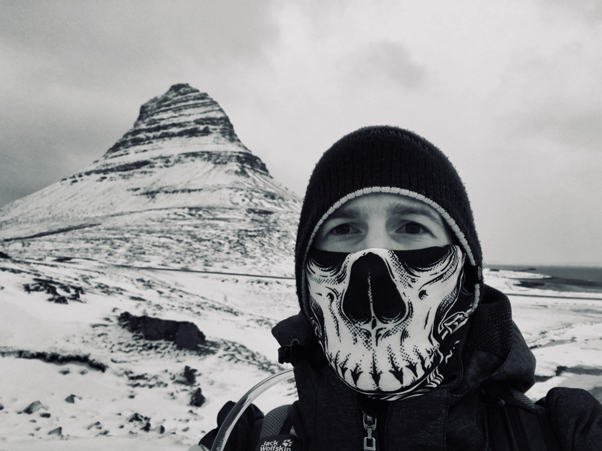
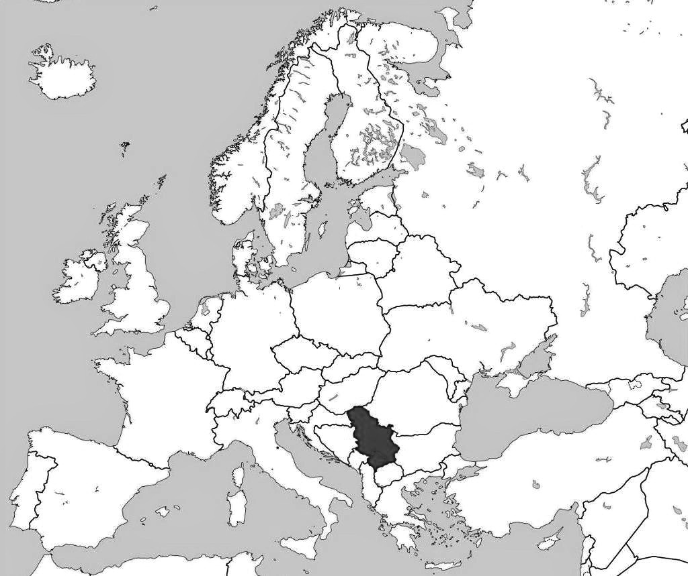

## Igor Popovic | Biography |

Born in July, 1991 in town of Pancevo, Republic of Serbia at the beggining of the Yugoslav civil war. Finished primary school in a small village of Banatsko Novo Selo and secondary Law-business school in Belgrade. I have completed my bachelor in Science (mathematics and statistics) from the University of Belgrade, [Faculty of Mathematics](http://www.matf.bg.ac.rs/eng/) in 2014. After graduation I started working for the largest petrochemical company in Serbia - "HIP-Petrohemija j.s.c. Pancevo" as Associate Statistician. After 4 years of work in my hometown I moved to city of Novi Sad where I started working for a company "Codeplicity LLC" as Data Analyst. 

## | Experience |

* **Data Analyst** - Codeplicity LLC Novi Sad
* **Assoc. for Statistics and Analytics - HR Department** - HIP-Petrohemija j.s.c. Pancevo
* **Data Processing Assistant III** - GfK LLC Belgrade
* **Freelance jobs via Upwork** math_master

## | Research |

* **Data Visualization** - University of Belgrade, Facutly of Mathematics
* **Lean Six Sigma, yellow belt** - NIS j.s.c. Novi Sad

My native language is Serbian, which all of my family members speak. When I was 9 years old I started learning English and Russian in school and now I can say I am fluent in those languages too. Why Russian and English at the same time, well one intresting thing in Serbian language is that we have two alphabets: Cyrilic and Latin and we used them respectfully. So learning Russian wasn't so hard for me to learn. Also, I speak and write in German, though just some simple sentences. I found out the best way to learn a foreign language is through reading and communication with native speakers in that language.

#### *“If you talk to a man in a language he understands, that goes to his head. If you talk to him in his own language, that goes to his heart.” ‒Nelson Mandela*

**Some of my project:**

* [HIP-Petrohemija - Overview report](https://www.hip-petrohemija.com/o-nama/osnovne-informacije.61.html) - English version
* [HIP-Petrohemija - Overview report](https://www.hip-petrohemija.com/o-nama/osnovne-informacije.513.html) - Russian version

